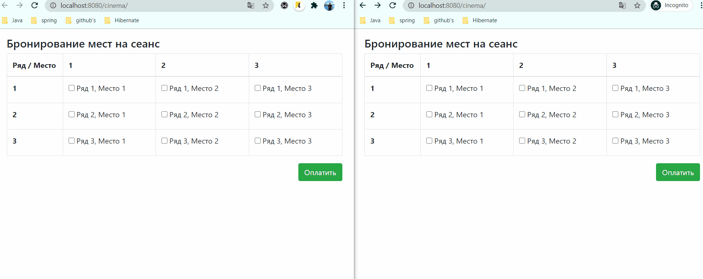
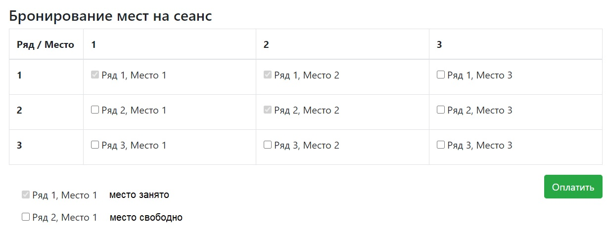
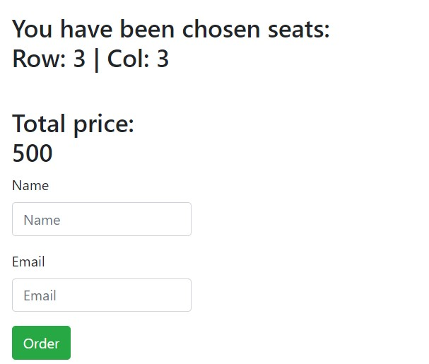

## Cinema booking service

### О проекте
Сервис позволяет забронировать билеты в кинотеатр. Основан на асинхронных сервлетах и ajax
. Это позволяет видеть какие места свободны, а какие заняты
 без обновления страницы. Данные обновляются по технологии long-polling.
 Данные по бронированиям кэшируются в памяти для снижения нагрузки на БД.
### Technologies
* Java 14
* Java EE Servlets
* Apache Tomcat
* Postgres
* JS, AJAX, HTML (front)
* Gson for parsing JSONs
* Maven as a build system
* Travis CI
### Возможности
* Бронирование мест. Места сохраняются за пользователем (регистрация происходит на странице бронирования). Данные по бронированиям и пользователи сохраняются в БД. Клиент с контроллером обмениваются сообщениями в формате JSON.
* Расчет стоимости билетов в соответствии с выбранными местами.
### Demo
Booking demo

Cinema hall schema

Booking page
